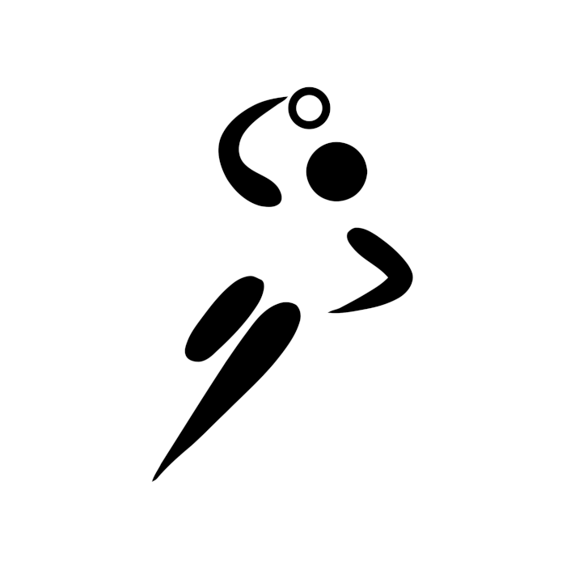
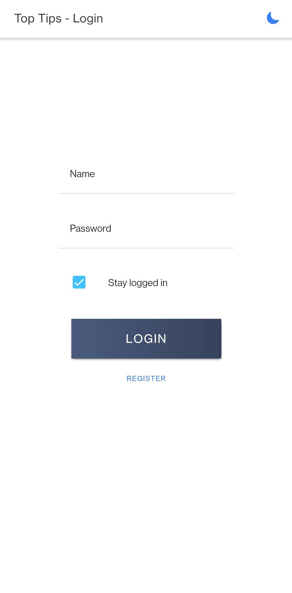
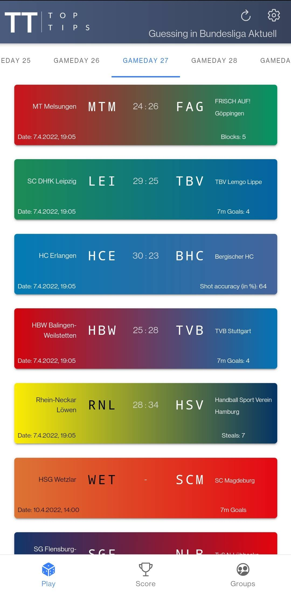
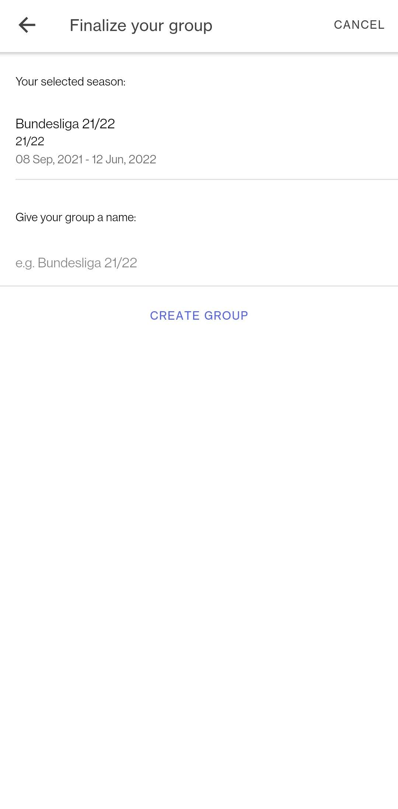
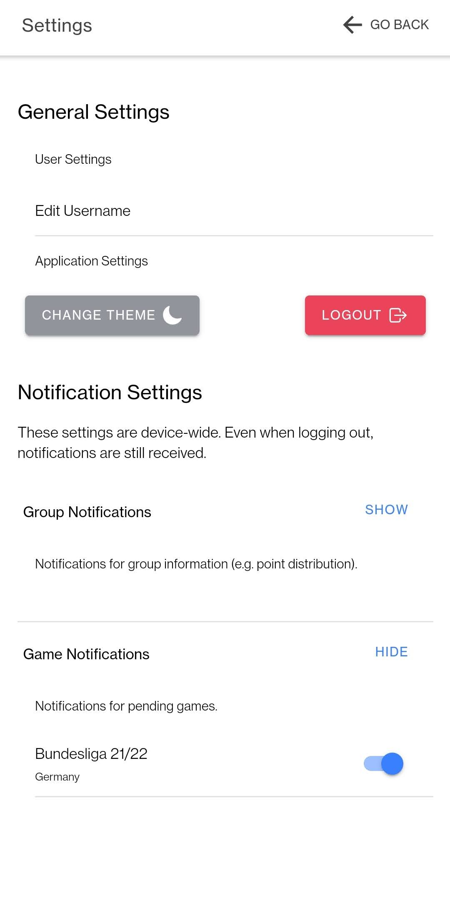

<h1 align="center">
  <br>
  <a href="http://app.kalmbach.dev"></a>
  <br>
  Top Tips
  <br>
</h1>
<p align="center">
  <a href='https://play.google.com/store/apps/details?id=app.kalmbach.dev&pcampaignid=pcampaignidMKT-Other-global-all-co-prtnr-py-PartBadge-Mar2515-1'></a>
  <!-- Google Play and the Google Play logo are trademarks of Google LLC. -->
</p>

<h4 align="center">A lightweight app for a handball guessing game.</h4>
<br>
<p align="center">
  <a href="#readme">
    
  </a>
  <a href="#readme">
    
  </a>
  <a href="#license">
    
  </a>
  <a href="https://app.kalmbach.dev">
    
  </a>
</p>
<p align="center">
  <a href="#readme">
    
  </a>
  <a href="https://www.codefactor.io/repository/github/tobi2k/toptips-app">
    
  </a>
  <a href="https://depfu.com/github/Tobi2K/TopTips-App?project_id=35393">
  
  </a>
  <a href="#readme">
    </a>
  <a href="#readme">
    
  </a>
  <br>
  <a href="#readme">
    
  </a>
  <a href="#readme">
    
  </a>
</p>

<hr>

<p align="center">
  
  
  
  
</p>

## What?

Top Tips is a lightweight guessing game for handball leagues. You can choose from more than 190 leagues in 30+ countries as well as international leagues.

You can create groups for different leagues and seasons and play with your friends.

## How?

Top Tips is built with [ionic](https://ionicframework.com/) and [vue](https://vuejs.org/). Ionic adds native android support and PWA support is provided by vue.

## Installation

Clone project and install dependencies

```bash
git clone https://github.com/Tobi2K/TopTips-App.git

cd TopTips-App && npm i
```

Install `@ionic/cli`

```bash
npm install -g @ionic/cli
```

Build and run project

```bash
ionic build && ionic serve
```

Build your own app bundle (AndroidStudio required)

```bash
ionic build
ionic cap copy
ionic cap sync
ionic cap open android # you might need to configure/export your AndroidStudio path
```

A guide for generating an app bundle or an apk can be found [here](https://developer.android.com/studio/publish/app-signing#generate-key)

## Usage

Feel free to try out the app yourself. You can find it on [Google Play](https://play.google.com/store/apps/details?id=app.kalmbach.dev) or use the [web version](https://app.kalmbach.dev).

Opening the web version in a compatible mobile browser will show a prompt to install a PWA version to your device.

## License

MIT License

Copyright (c) 2022 Tobias Kalmbach

Permission is hereby granted, free of charge, to any person obtaining a copy of this software and associated documentation files (the "Software"), to deal in the Software without restriction, including without limitation the rights to use, copy, modify, merge, publish, distribute, sublicense, and/or sell copies of the Software, and to permit persons to whom the Software is furnished to do so, subject to the following conditions:

The above copyright notice and this permission notice shall be included in all copies or substantial portions of the Software.

THE SOFTWARE IS PROVIDED "AS IS", WITHOUT WARRANTY OF ANY KIND, EXPRESS OR IMPLIED, INCLUDING BUT NOT LIMITED TO THE WARRANTIES OF MERCHANTABILITY, FITNESS FOR A PARTICULAR PURPOSE AND NONINFRINGEMENT. IN NO EVENT SHALL THE AUTHORS OR COPYRIGHT HOLDERS BE LIABLE FOR ANY CLAIM, DAMAGES OR OTHER LIABILITY, WHETHER IN AN ACTION OF CONTRACT, TORT OR OTHERWISE, ARISING FROM, OUT OF OR IN CONNECTION WITH THE SOFTWARE OR THE USE OR OTHER DEALINGS IN THE SOFTWARE.

---

> [kalmbach.dev](https://www.kalmbach.dev) &nbsp;&middot;&nbsp;
> GitHub [@Tobi2K](https://github.com/Tobi2K) &nbsp;&middot;&nbsp;
> Email [t.kalmbach35@gmail.com](mailto:t.kalmbach35@gmail.com)
